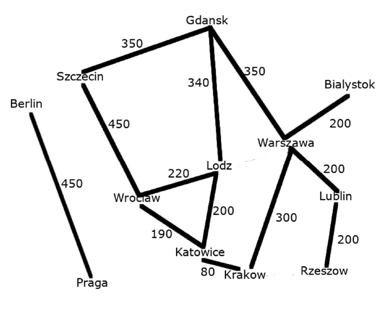

# Projekt "map-rip"
Projekt map-rip to symulacja pierwszej wersji protokołu routingu RIP (Routing Information Protocoll). Protokół RIP jest, a właściwie był, używany w sieciach komputerowych przez routery do odnalezienia najlepszej drogi to innych routerów.  Każdy router w sieci jest identyfikowany przez adres IP. Jednak, żeby projekt był czytelniejszy, zastąpiłem adresy IP nazwami miast, ale oprócz tego protokół działa tak samo jak RIP 1. Cały czas jest to symulacja algorytmu routingu, a nie program do odnalezienia najszybszej drogi między dwoma miastami. W związku z tym, każde miasto jest tak naprawdę osobnym niezależnym bytem, który przechowuje informacje o tym jak dojść do każdego innego miasta na mapie; dokładnie tak samo jak routery w sieci komputerowej działają niezależnie od innych routerów. Oczywiście można też tej biblioteki użyć do jakiegoś programu z mapą, jeżeli bardzo często potrzebujemy się dowiedzieć jak dojść z miasta A do miasta B, a mapa modyfikowana jest bardzo rzadko.  
Przejdę teraz do wyjaśnienia jak algorytm działa, w następnej sekcji można zobaczyć jak program można skompilować i jak można go używać.

## Zasada działania
Na poniższym zdjęciu jest przykładowa mapa, którą można utworzyć w naszym programie. Jak widać jest to mapa niektórych miast Polski oraz Praga i Berlin, połączone tylko ze sobą.

Niektóre miasta są ze sobą połączone, inne nie. Jeśli dwa miast są ze sobą połączone to podana jest odległość między nimi. Każde miasto posiada listę wszystkich swoich sąsiadów oraz odległości do nich (,ale nie zna struktury reszty mapy). Oczywiśćie każde miasto zna też swoją nazwę.
  
Załóżmy teraz, że miasto Lublin chce się dowiedzieć jak dostać się do miasta Katowice. Masto, które chce się dowiedzieć jak gdzieś dojść, nazywane będzie od teraz Miastem Startu. Miasto, do którego należy znaleść drogę, nazywane będzie od taraz Miastem Celu. Miasto Startu (Lublin), aby poznać trasę do Miasta Celu (Katowic), wysyła wszystkim swoim sąsiadom zapytanie o to, czy wiedzą jak trafić do Miasta Celu. Każde miasto, które dostanie zapytanie, sprawdza najpierw czy jest ono Mastem Celu. (W tym przypadku sprawdza, czy samo nazywa się Katowice.) Jeżeli jest jakimś innym miastem, to wysyła wszystkim swoim sąsiadom zapytanie, czy wiedzą jak trafić do Miasta Celu. W ten sposób zapytanie to trafia w końcu (o ile to możliwe), do Miasta Celu. Jeżeli Miasto Celu dostanie to zapytanie, to odsyła odpowiedź, że jest tym miastem. Następnie pokoleji wszystkie miasta które dostaną odpowiedź, wysyłają odpowiedź do miasta które pytało o drogę do Miasta Celu. Tym samym Miasto Startu, dostaje wszystkie możliwe trasy do Miasta Celu. Miasto Startu (Lublin) wybiera dwie najlepsze trasy, o ile trasy te istnieją, do Miasta Celu (Katowic) i je sobie zapisuje.

Czyli na początek Lublin wyślę zapytanie do Rzeszowa czy wie jak dojść do Katowic, a że Rzeszów nie ma żadnych innych według obok Lublina to odeślę informacje z powrotem że sorry nie wiem jak dojść do Katowic kropka Następnie miasto Lublin wyślę taką samą zapytanie do Warszawy, a Warszawa wyślę takie same zapytanie do wszystkich swoich sąsiadów kropka Następnie to samo zrobię jej Gdańsk Łódź Kraków Wrocław Szczecin. Każde miasto wysyłając zapytanie, wysyła także aktualną trasę, przed bytą już przed zapytaniem kropka Następnie Każde miasto najpierw sprawdza czy sąsiad do którego chcę wysłać zapytanie jest na liście trasy zapytania, jeżeli jest to nie wysyłaj zapytania do tego sąsiada kropka W ten sposób protokół routingu nie dopuszcza do pętli. Kiedy miasto Katowice dostanie zapytanie czy jak dojść do Katowic, co odeślę informację Tak wiem to ja to taka jest droga do Katowic kropka następny wszystkie miasta będą z powrotem odsyłały zapytania aż wszystkie możliwe trasy z Lublina do Katowic dojdą do Lublina, następnie miasto Lublin wybierze spośród tych wszystkich tras dwie najlepsze i jest zapisze. Następny sexy pokażę jak zainstalować i używać naszej biblioteki z linii poleceń.