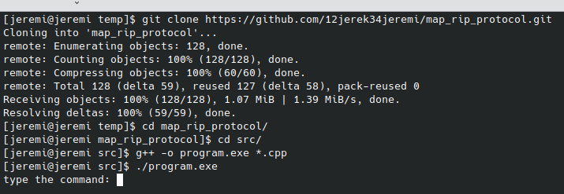
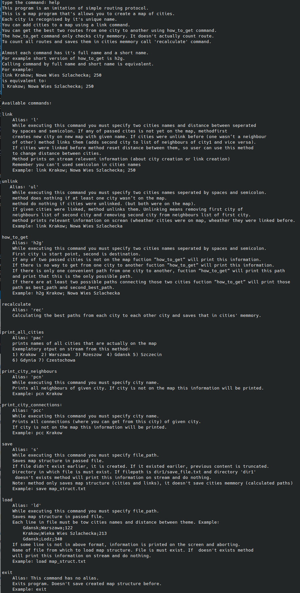
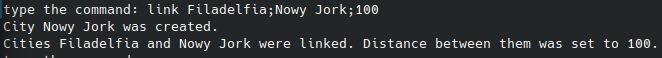
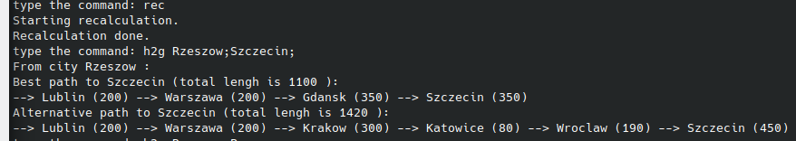
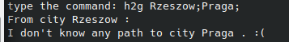
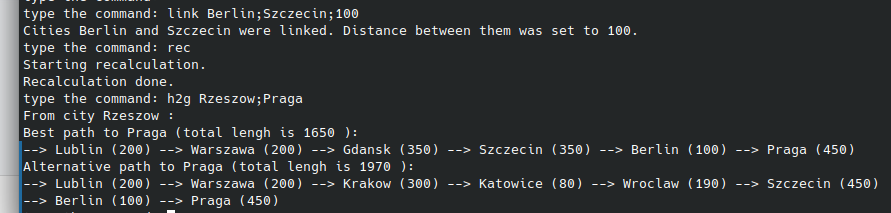
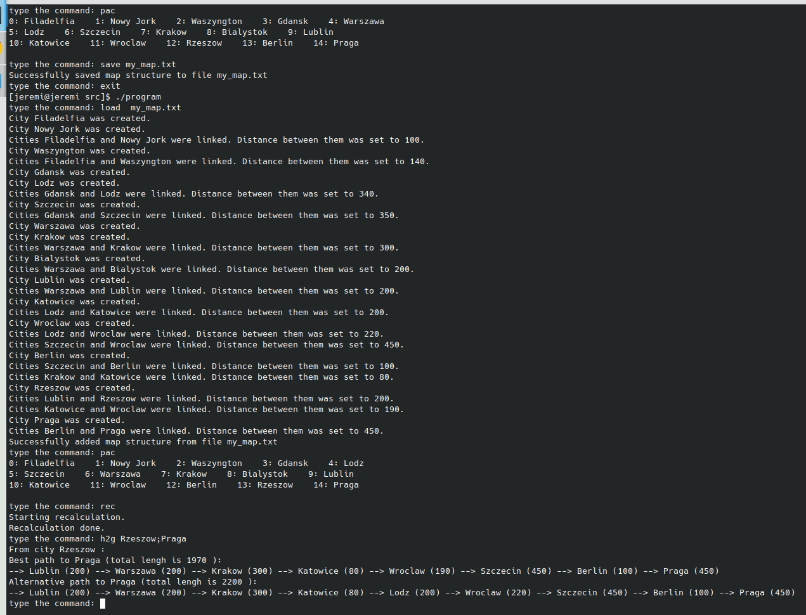

# Symulacja protokołu RIP (Routing Information Protocol)
 Jeżeli wolisz oglądać niż czytać, to zamiast czytania tego pliku, możesz obejrzeć [to_video](https://link-url-here.org), w którym wyjaśniam jak działa algorytm zastosowany w tym programie oraz jak można program skompilować ze żródeł, uruchomić i jak można go używać.  
Projekt map-rip to symulacja pierwszej wersji protokołu routingu RIP (Routing Information Protocoll). Protokół RIP jest, a właściwie był, używany w sieciach komputerowych przez routery do odnalezienia najlepszej drogi to innych routerów.  Każdy router w sieci jest identyfikowany przez adres IP. Jednak, żeby projekt był czytelniejszy, zastąpiłem adresy IP nazwami miast, ale oprócz tego protokół działa tak samo jak RIP 1. Cały czas jest to symulacja algorytmu routingu, a nie program do odnalezienia najszybszej drogi między dwoma miastami. W związku z tym, każde miasto jest tak naprawdę osobnym niezależnym bytem, który przechowuje informacje o tym jak dojść do każdego innego miasta na mapie; dokładnie tak samo jak routery w sieci komputerowej działają niezależnie od innych routerów. Oczywiście można też tej biblioteki użyć do jakiegoś programu z mapą, jeżeli bardzo często potrzebujemy się dowiedzieć jak dojść z miasta A do miasta B, a mapa modyfikowana jest bardzo rzadko.  
Przejdę teraz do wyjaśnienia jak algorytm działa, w [następnej sekcji](#jak-skompilować-program-i-go-używać) można zobaczyć jak program można skompilować i jak można go używać.  

## Zasada działania algorytmu imitującego protokuł RIP.
Na poniższym zdjęciu jest przykładowa mapa, którą można utworzyć w naszym programie. Jak widać jest to mapa niektórych miast Polski oraz Praga i Berlin, połączone tylko ze sobą.
 
Niektóre miasta są ze sobą połączone, inne nie. Jeśli dwa miast są ze sobą połączone to podana jest odległość między nimi. Każde miasto posiada listę wszystkich swoich sąsiadów oraz odległości do nich (,ale nie zna struktury reszty mapy). Oczywiśćie każde miasto zna też swoją nazwę.
  
Załóżmy teraz, że miasto Lublin chce się dowiedzieć jak dostać się do miasta Katowice. Masto, które chce się dowiedzieć jak gdzieś dojść, nazywane będzie od teraz Miastem Startu. Miasto, do którego należy znaleść drogę, nazywane będzie od taraz Miastem Celu. Miasto Startu (Lublin), aby poznać trasę do Miasta Celu (Katowic), wysyła wszystkim swoim sąsiadom zapytanie o to, czy wiedzą jak trafić do Miasta Celu. Każde miasto, które dostanie zapytanie, sprawdza najpierw czy jest ono Mastem Celu. (W tym przypadku sprawdza, czy samo nazywa się Katowice.) Jeżeli jest jakimś innym miastem, to wysyła wszystkim swoim sąsiadom zapytanie, czy wiedzą jak trafić do Miasta Celu. W ten sposób zapytanie to trafia w końcu (o ile to możliwe), do Miasta Celu. Jeżeli Miasto Celu dostanie to zapytanie, to odsyła odpowiedź, że jest tym miastem. Następnie pokoleji wszystkie miasta które dostaną odpowiedź, wysyłają odpowiedź do miasta które pytało o drogę do Miasta Celu. Tym samym Miasto Startu, dostaje wszystkie możliwe trasy do Miasta Celu. Miasto Startu (Lublin) wybiera dwie najlepsze trasy, o ile trasy te istnieją, do Miasta Celu (Katowic) i je sobie zapisuje. Należy dodać jedną ważną rzecz. Wraz z zapytaniem do miasta jest wysyłana tak zwana "Lista Zapytania". Lista zapytania to lista wszystkich miast, przez które przeszło zapytanie. Każde miasto wysyłajac zapytanie dalej dodaje siebie do Listy Zapytania. Po drugie, każde miasto, przed wysłaniem zapytania dalej, sprawdza, czy miasto, do którego chce wysłać zapytanie, znajduje się na liście miast. Jeżeli tak jest to zapytanie nie jest wysyłane. W ten sposób unikane są pętle - zapytania nie krążą w kółko w grafie. Aby uruchomić opisany powyżej algorytm w programie 'map-rip' należy użyć komendy 'recalculate', więcej o tym w następnej sekcji pliku. Po uruchomieniu komendy 'rec' wszystkie miasta wyślą zapytania jak trafić do innych miast i poznają trasy, które sobie zapiszą.  

## Jak skompilować program i go używać:
 

### Kompilacja i uruchomienie
Najpierw komendą git clone należy sklonować repozytorium. a następnie przejść do nowo utworzonego katalogu.
~~~
git clone https://github.com/12jerek34jeremi/map_rip_protocol.git
cd map_rip_protocol
~~~
Aby skompilować projekt należy przejść do katalogu src i użyć komendy g++. Komendzie g++ należy po prostu podać wszystkie pliki o rozszerzeniu .cpp znajdujace się w katalogu src. (Zakładam że gcc, lub mingw w przypadku windowsa, jest zainstalowane i dodane do ścieżki, a zatem komenda g++ jest dostępna z terminala.) Następnie można już uruchomić progam.
~~~
cd src
g++ -o program.exe *.cpp
~~~
 
 
### Lista komend.
Po wpisaniu help, program wypisze instrukcje używania oraz liste wszystkich dostępnych komend wraz z ich opisami.
~~~
help
~~~
 

Nie będę teraz omawiał każdej z tych komend, można po prostu sobie poczytać. Dodam tylko, że komenda ma swój alias, alias wykonuje dokładnie to samo co komenda, ale jest krótszy i nie trzeba tyle pisać. Przykładowo aliasem komendy "how_to_get" jest "h2g".
  
### Tworzenie nowych miast, łączenie ich i zmienianie odległości między miastami
Aby utworzyć nowe miasto należy użyć komendy link. Komendzie link podaje się dwa miasta odzdzielone średnikiem oraz odległości między nimi. Jeżeli jakieś miasto o podanej nazwie jeszcze nie istnieje w programie, to zostanie utworzone.
Następnie, jeżeli miasta nie są połączone, to zostaną ze sobą połączone. Jeżeli podane miasta są połączone, to dystans między tymi miastami zostanie zmieniony na dystans podany przez użytkownika. Czyli komendy link można użyć do tzech rzeczy: utworzenia nowych miast, połączenia dwóch miast i zmienienia odległości między miastami. 

Poniższą komendą utworzę teraz dwa miasta: Waszyngton oraz Filadelfia. Odległość między nimi ustawię na 140 km.
~~~~~~~~~~~~~~~~
link Waszyngton;Filadelfia;140
~~~~~~~~~~~~~~~~
 
Jak widać oba miasta zostały utworzone, a odległość została ustawiona na 140 km. Połączę teraz Nowy Jork z Filadelfią. Ponieważ miasto Nowy Jork jeszcze nie istnieje naszym programie to zostanie utworzone automatycznie.
~~~
link Filadelfia;Nowy Jork;100
~~~
 
 
### Poznawanie trasy między miastami
Aby miasta poznały trasy do innych miast, czyli żeby przekalkulować mapę, należy użyć komendy 'recalculate' lub jej aliasu 'rec'. Wtedy miasta wyślą zapytania jak trafić do  innych miast, zapytania te zostały omówione w [poprzedniej sekcji](#zasada-działania-algorytmu-imitującego-protokuł-rip). Następnie, aby dowiedzieć się jak dostać się z misata A do miasta B, należy użyć komendy how_to_get, lub jej a  aliasu h2g. Przykładowo chcemy się dowiedzieć jak trafić z Waszyngtony do Nowego Jorku.
~~~
rec
h2g Waszyngton;Nowy Jork;
~~~
 
Komendy 'recalculate' należy użyć po każdej modyfikacji mapy. Nie trzeba jej wywoływać przed każdym wywołaniem komendy 'how_to_get'. Oczywiście, można kilka razy zmodyfikować mapę i dopiero po kilku modyfikacjach, przed wywołaniem komendy 'how_to_get', wywołać komendę 'recalculate'. 
  
### Dalsze modyfikowanie mapy
Oczywiście powyższy przykład jest bardzo prosty, przejdźmy do trochę trudniejszego przykładu. Program pozwala na utworzenie uproszczonej mapu Polski, która znajduje się na zdjęciu niżej. Poniższą mapę można utworzyć krótką komendą "poland". 
 
~~~
poland
~~~
 
Jak widać wszystkie miasta zostały dodane i połączone ze sobą. Ponownie użyję komendy recalculate, aby uruchomić algorytm imitujacy protokół RIP. Zobaczmy jak wygląda trasa z Rzeszowa do Szczecina.
~~~
rec
h2g Rzeszow;Szczecin;
~~~
 

Program pokazał  dwie możliwe trasy, obie poprawne. Zobaczmy jak można trafić z Rzeszowa do Pragi.
 ~~~
 h2g Rzeszow;Praga;;
 ~~~
  
 Program twierdzi, że nie istnieje żadna trasa z Rzeszowa do Pragi. Jest to prawda, miasta Praga i Berlin są odizolowane od  reszty grafu. Użyję teraz komendy link połączyć Berlin z Szczecinem, a odległość między nimi ustawię na 100 km. Przekalkuluję mapę i spytam się jak trafić z Rzeszowa do Pragi. 
 ~~~
 link Berlin;Szczecin;100
 rec
 h2g Rzeszow;Praga
 ~~~
  

Jak widać program ponownie wskazał dwa trasy. Używając komendy  unlink rozłącze teraz Warszawę i Gdańsk. Ponownie  przekalkuluje mapę i spytam się programu jak dojść z Rzeszowa do Pragi. Program pokazuje dwie trasy, jednak żadna z nich nie korzysta z bezpośredniego połączenia między Warszawą a Gdańskiem. Trasy się wydłużyły ale tego można było się spodziewać, trzeba jechać naokoło.
~~~
unlink Warszawa;Gdansk;
rec
h2g Rzeszow;Praga
~~~

  
### Zapisywanie mapy i ładowanie mapy z pluku
Komendą print_all_cities (alias pac) można wypisać wszystkie miasta znajdujące się obecnie na mapie programie.
~~~
pac
~~~
 
Do zapisywania mapy w pliku służy komenda save, do wczytania mapy z pliku służy komenda load. Komenda save zapizuje w pliku strukturę mapy, wszystkie połączenia między miastami. Nie zapisuje nauczonych tras. Jeżeli, używająć komendy save, zapiszemy w danym pliku mapę, a później z tego samego pliku załadujemy mapę komendą load, to aby dowiedzieć się jak trafić z miasta A do miasta B należy najpierw przekalkulować mapę (komenda 'rec').
Dla przykładu zapiszę teraz mapę w pliku "my_map.txt", wyjdę z programy, uruchomie program ponownie, załaduje mapę z pliku my_map.txt. Jak widać komenda pac pokazuje, że po załadowaniu mapy z pliku na mapie znajdoują się wszystkie miasta, jakie znajdowały się na niej w poprzedniej egzekucji programu. Po przekalkulowaniu mapy program cały czas odnajduje prawidlowa trase z Rzeszowa do Pragi.
~~~
save my_map.txt
exit
~~~
~~~
./program
~~~
~~~
load my_map.txt
pac
h2g Rzeszow;Praga
~~~
 

