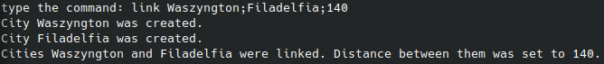
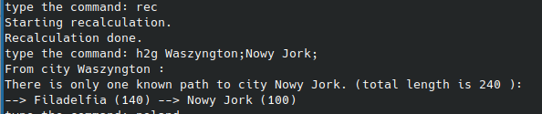
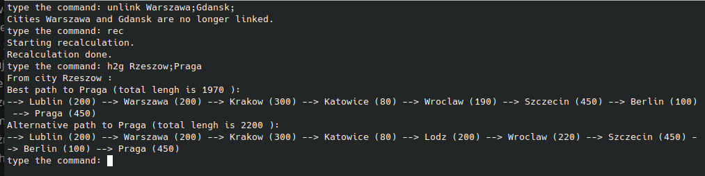
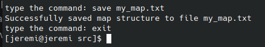

# Routing Information Protocol (RIP) simulation
 If you prefer watching to reading, then, instead of going through this file, you can watch [this video](https://drive.google.com/file/d/1NYirSYcOkGkS0SOM7VKnOhkDMNWIPKke/view?usp=share_link). In that video I explain how the algorithm used in this program works, how to compile the program from the source code, how to run it and how to use it.  
The map-rip project is a simulation of the first version of the RIP (Routing Information Protocol). The RIP protocol is, or rather was, used by routers in computer networks to find the best route to other routers. Each router in a network is identified by an IP address. However, to make the project more readable, I replaced IP addresses with city names. Apart from that, the protocol works exactly like RIP 1. This is still a simulation of the routing algorithm, not a program to find the fastest route between two cities. Therefore, each city is actually a separate independent entity that stores information about how to reach every other city on the map, just like routers in a computer network operate independently of other routers. Of course, you can also use this library for some program with the map, if you really often need to find out how to get from city A to city B, and the map is modified quite rarely.  
Below, I explain how the algorithm works, in the [next section](#how-to-compile-and-use-the-program) you can see how to compile the program and how to use it.  

## How the algorithm simulating the RIP protocol works
The following image shows a map example that can be created in our program. As you can see, it is a map of some polish cities, Praga (Prague) and Berlin.
 
Some cities are connected, others are not. If two cities are connected, then the distance between them is given. Each city knows a list of all its neighbors and the distances to them (, but does not know the structure of the rest of the map). Of course, each city also knows its own name.
  
Now suppose that the city Lublin wants to know how to get to the city Katowicie. A Cdity, which wants to know how to get somewhere, is called Start City. A city, to which you want to find a route, is called Destination City. Start City (Lublin), in order to find a route to the Destination City (Katowice), sends to all its neighbors a query whether they know how to get to the Destination City. Each city that receives an quier, first checks if it itself is a Destitnation Mast. (In this case, it checks if it itself is Katowice.) If it is some other city, it asks all of its neighbors if they know how to get to the Destitnation City. In this way, the query finally (if possible) ends up in the  Destination City. If the Destitnation City receives this query, it returns the response that it is the Destination City. Then, in turn, all cities that received a query, send a response to the city, that asked for directions to the Destination City. Thus, the Start City gets all possible routes to the Destination City. The Start City (Lublin) selects two best routes, if they exist, to the Destination City (Katowice) and saves them.
  One important thing should be added. Together with the query, the so-called "Query List" is sent. The query list is a list of all cities that the query went through. Each city, before sending a query further, adds itself to the Query List. Secondly, each city, before sending the query further, checks whether the city to which it wants to send the query is on the Query List. If so, the query is not sent. This way loops are avoided - queries don't go round and round in the graph. To run the algorithm described above in the 'map-rip' program, use the 'recalculate' command, more on that in the next section of the file. When you run the 'recalculate' command, all cities ask how to get to other cities, learn the routes and save them.

## How to compile and use the program:
 

### Compilation and execution
First, use the `git clone` command to clone the repository, then use `cd` command to go to the newly created directory.
~~~
git clone https://github.com/12jerek34jeremi/map_rip_protocol.git
cd map_rip_protocol
~~~
To compile the project, go to the src directory and use the g++ command. To  g++ command you simply need to pass all the .cpp files, which are in the src directory. (I'm assuming gcc, or mingw for windows, is installed and added to the path, so the g++ command is available from the terminal.) Now you're ready to run the program.
~~~
cd src
g++ -o program *.cpp
~~~
 
 
### Command list.
After typing help, the program will print instruction and a list of all available commands along with their descriptions.
~~~
help
~~~
 

I'm not going to discuss each of these commands now, you can just read it by yourself. I just add that each command has its alias. The alias does exactly the same thing as the command, but it is shorter and you don't need to write so much. For example, an alias of the "how_to_get" command is "h2g".
  
### New cities creation, city linkage and change of a distance between two cities.
To create a new city, use the link command. To the link command you need to pass names of two cities and distance between those cites. If any of the passed cities doues not exist yet in the program, it is created. Then, if the cities are not connected, program connects them. If the given cities are connected, then the distance between these cities is changed to the distance specified by the user. So the link command can be used for three things: to create new cities, to connect two cities and to change the distance between two cities. 

The following command creates two cities: Washington and Philadelphia. It sets the distance between them to 140 km.
~~~~~~~~~~~~~~~~
link Waszyngton;Filadelfia;140
~~~~~~~~~~~~~~~~
 
As you can see both cities were created and the distance was set to 140 km. Now I' going to connect New York to Philadelphia. Since the city of New York does not yet exist in our program, it is created automatically.
~~~
link Filadelfia;Nowy Jork;100
~~~
 
 
### Getting to know the route between two cities
If you want cities to find routes to other cities, i.e. to recalculate the map, use the command 'recalculate' or its alias 'rec'. If you do this, then each city sends queries how to get to other cities, these queries were discussed in [the previous section](#how-the-algorithm-simulating-the-rip-protocol-works). Then, to find out how to get from city A to city B, use the command how_to_get, or its alias h2g. For example, you want to know how to get from Washington to New York:
~~~
rec
h2g Waszyngton;Nowy Jork;
~~~
 
The 'recalculate' command should be used after each map modification. It doesn't need to be called before every 'how_to_get' command. Of course, you can modify the map several times and after  modifications, before calling the 'how_to_get' command, call the 'recalculate' command.
  
### More of map modification
Of course, the above example is very simple, let's move on to a slightly more difficult example. The program allows you to create a simplified map of Poland, which is shown in the picture below. The following map can be created quickly with a "poland" command. 
 
~~~
poland
~~~
 
As you can see all the cities have been added and connected to each other. I'm going to use the recalculate command again to run the RIP imitation algorithm. Let's see how to get from Rzeszow to Szczecin.
~~~
rec
h2g Rzeszow;Szczecin;
~~~
 

The program showed two possible routes, both correct. Let's see how you can get from Rzeszow to Praga.
 ~~~
 h2g Rzeszow;Praga;;
 ~~~
  
The program claims that there is no route from Rzeszow to Praga. It is true, the cities Prage and Berlin are isolated from the rest of the graph. I'm going to use the link command to connect Berlin with Szczecin and set the distance between them to 100 km. I'm going to recalculate the map and ask how to get from Rzeszow to Praga.
 ~~~
 link Berlin;Szczecin;100
 rec
 h2g Rzeszow;Praga
 ~~~
  

As you can see, the program again showed two routes. Now I'm going to us an unlink command to disconnect Warsaw and Gdansk. I'm going to recalculate the map and ask the program how to get from Rzeszow to Praga. The program shows two routes, but neither of them uses a direct connection between Warsaw and Gdańsk. The routes are longer, but that was to be expected, you have to go around.
~~~
unlink Warszawa;Gdansk;
rec
h2g Rzeszow;Praga
~~~

  
### Saving and loading a map from file
With the print_all_cities (alias pac) command, you can print all cities, which are currently on a map.
~~~
pac
~~~
 
The save command is used to save a map in a file and the load command is used to load a map from a file. The save command just saves the map structure in a file, all connections between cities. The save command does not save learned routes. If you save map in a file using the save command and then you load the map from the same file using the load command, then if you want to get route from city A to city B, you need to first recalculate a map (command recalculate).
For example, I'm going to save the map in a file called "my_map.txt", exit the program, restart the program, load the map from the file my_map.txt. As you can see, the pac command shows all the cities that were on the map in the previous execution. After recalculating the map, the program still finds the correct route from Rzeszow to Praga.
~~~
save my_map.txt
exit
~~~
~~~
./program
~~~
~~~
load my_map.txt
pac
h2g Rzeszow;Praga
~~~
 

